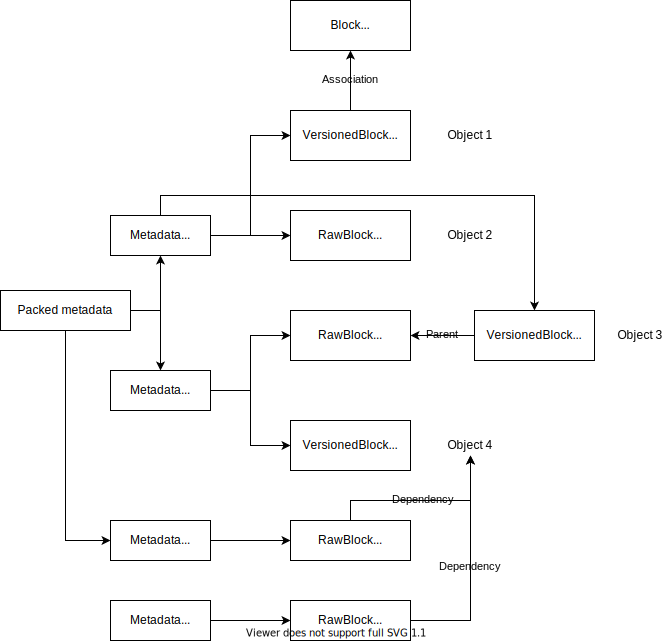

# Melotte Protocol

Melotte is a decentralized application platform and framework, based on libp2p. In contrast to recent novel decentralized networks, Planet focuses on the original purpose of P2P, to bring privacy and anonymity.

An overview of the whole protocol stack (bottom-up):

- Libp2p
  - More transports, e.g. kcp, tor
  - Obfuscation protocol, to replace multistream protocol
- Block protocols
  - Bitswap
  - Compatibility protocols (possible): Bittorrent, Dat, ZeroNet (files only)
  - Planet bitswap (planned)
- Channel protocols
  - Pubsub (gossipsub/floodsub)
- Propagtion protocols
  - Channel propagtion
  - DHT
- Graph data structure
  - Management chain
  - Data graph
- Backend procedure
  - Web of trust
    - Naming
    - Filter
  - eWasm validation script
  - Wasm application backend
- Interface server
- Application Frontend

## Obfsucation protocols [unfinished]

Pattern recognition is a popular censorship method, yet most p2p protocols have obvious protocol characteristics. Encryption protocols can't solve this problem, because the protocol handshake (multistream) for encryption can be recognized by GFW.

libp2p supports protocol negotiation. Unfortunately, it was proven to be easily detectable by DPI methods. Instead of using protocol negotiation, we use multiaddr-level protocol specification. For instance, the following protocols are supported, except libp2p defaults:

- TLS
- Websockets with obfuscated multistream handshake [TODO]
- *Other candidates are possible and welcome*

## Channel and block protocols

Planet uses the following two protocols under the hood:

- *Channel protocol*, which is inefficient for long-term storage and unreliable. However, it has very low latency. The realtime protocol can be compared to UDP in clearnet. The primary usecases for the realtime protocol are:
  - Instant messaging.
  - Video streaming.
- *Block protocol*, which supports compression and delta-encoding, old data pruning, etc., however has high latency. The data protocol is like TCP in clearnet. The primary usecases for the data protocol are:
  - Git hosting.
  - Collaborative wiki.
  - Video hosting.

Applications often use these two protocols together:

- Instant messaging. Messages arrive in channels first. In case the receiver isn't online, messages are also stored temporarily by every peer on this site until the receiver downloads them or the messages die.

Both *IPFS blocks and objects* are a part of *block protocol*.

> The abstraction of block and channel protocols are based on existing implementations. Channel is only one of the propagtion protocols.

## Block protocol

Block protocol uses _data blocks_ as packets. Data blocks are used to transfer _objects_, which is a collective term for all raw data.

> The reference that a block uses for delta-codec is called `base`

Data blocks contain object content in a compressed and encoded format. Say, instead of sending raw version content, one would encode the data, put it into a data block and send the block.

> Data block, also known as, block.

For instance, the following formats could be or are supported:

- *Delta-encoding*: a block is compared with its historical blocks and other related blocks, and instead of raw block content, two values are stored:
  - A list of *bases*, i.e. references to some older blocks
  - *Delta*, one of the codecs is:
    - *Copy* action allows copying a part of some base to the current block
    - *Insert* action allows adding arbitrary new data
    - For instance, if the base contents are `ABCDEFGHIJ` and `QRSTUVWXYZ`, then the whole English alphabet can be efficiently represented as:
      - *Copy* bytes 0..10 from the first base
      - *Insert* letters `KLMNOP`
      - *Copy* bytes 0..10 from the second base
- *Compression*: object data is gzip-compressed

Additionally, the formats can be stacked on top of each other. Notice that order matters: i.e. first delta-encoding and then compressing data is more efficient than first compressing it and then delta-encoding. The first way is known as stacking compression *on top of* delta-encoding, the second way is stacking delta-encoding *on top of* compression.

The CID that is announced on the DHT is a hash of the actual non-encoded data, ie. *objects*, not the hash of a data block.

Data blocks can be sent to other peers in the following two ways:

- *Per-connection*, or *dynamic block* mode. This allows using a different codec or different data for each peer. This method may be slow but it is way better for network connectivity: a peer which doesn't support a new codec may still receive new content, while others peers which support it will receive it compressed even better. This method, however, requires developing a new protocol.
- *Static block* mode. In this mode, the same data block is used for all peers who request a specific object. This allows using the Bitswap protocol to transfer data blocks. However, static block protocol is inefficient in some cases. When the compression methods are updated, the majority serve the content using new codec, so the blocks of old codec are rarely served, splitting the network, which decreases overall performance. Besides compatibility and consistency, static method is rigid, for it can't encode the data dynamically based on the circumstances of the receiver.

A data block has a slightly different meaning for these two modes. In static block mode, a data block is effectively a valid IPFS block on its own. In dynamic block mode, a data block is temporary and abstract, and it doesn't have to be stored directly in the filesystem; however this caching may still be done for optimization.

> 'Verify' means verification of signature of publickey encryption, but 'validate' has a broader meaning.

In both cases, due to the nature of a data block, it is perfectly valid to make a new block and claim it is a newly encoded version of an object. Although the object content is signed by the content author and thus can be easily verified, a data block cannot be verified until it's decoded. This gives opportunities for DoS and allows exponential data size growth, even when the data block size is small: for instance, each block could duplicate to the previous one by performing the copy action on it twice.

A simple hotfix for this problem is that the object signer should also sign the data block; however, this fix breaks when either of the two conditions hold:

- A block author is not trusted. This is a common situation in multiuser sites.
- A block author may leave the network. This hotfix effectively rejects any updates to a data block after the author leaves the network.

Another solution is proposed instead. It is well-known that most if not all modern compression algorithms, and thus codecs, allow getting unpacked data length quickly. This allows checking if data length is not greater than the maximum allowed length before actually unpacking content.

```typescript
interface VersionedBlock {
    prevCID: CID[];
}

interface RawBlock { // Multicodec prefixed, compatible with IPFS
}

interface EncodedBlock extends VersionedBlock { // Multicodec prefixed
    codec: Codec;
    encodedData: Buffer;
}

enum DeltaType {
    none = 0,
    plaintext = 1,
    binary = 2
}

interface Codec {
    gzip: boolean;
    delta: DeltaType;
}

// One of the delta codecs

interface CopyAction {
    action: "copy";
    baseFrom: number;
    offset: number;
    count: number;
}

interface InsertAction {
    action: "insert";
    data: Buffer;
}

interface DeltaEncodedData {
    CID[] bases;
    (CopyAction | InsertAction)[] delta;
}
```

## Channel protocol

The channel protocol are used for two purposes:

- _Metadata_. When a site is updated, i.e. a new version is published, the channel protocols are used to send new version CID to site seeders.
- _Realtime data_. This includes chat messages, etc.

Each `ChannelData` MUST be signed with a publickey.

```typescript
interface ChannelData {
    sender: Publickey; // sender field can be either the ‘sender' or others. For example, a peer requests the data of a site with pubkey
    signature: Buffer;  // Signature, size limited
}
interface Metadata extends ChannelData { // Metadata for the site, or the content of a user
    timestamp: Date; // See time guarantee below
    blocks: CID[];
    blocksArchived: CID[];
    extraData: Buffer;  // Urgent data, size limited
    prevMetadata?: CID; // CID of the previous metadata
    // This actually creates a metadata chain, but normally it is not used.
    subMetadata?: CID[];
}
interface RealTimeData extends ChannelData {  // Example: Instant messaging
    data: Buffer;
}
```

## Site


Publishing new versions of a site or its user content can only take place on channels, because you can't put a link pointing to the new version in the block of the previous version. Given a genesis management block of a site, it's impossible to get its sucessors without channel protocol. Another aspect is user/site content, which is basically aggregating based on some rules, ie. data script. In addition to the graph, when the author signs and publishes the metadata of his blocks, other peers listening on the channel *cache* the received metadata in the repo, as if they are blocks, and *re-propagate* the metadata when other peers request it. For each version of an `object`, the signer generates a new metadata. The dafult behaviour (well-behaving) of a peer is to re-propagate the *newest* version of an object, since new blocks normally link to old blocks. To identify which block you got is the successor of an arbitrary block, the successor block (or its metadata) should contain a link to its previous version. key-value store to track the history of each object, which uses the CID of the first block of the object as key, the last CID of the block of the object as value. Each block of an object is called a commit or a version, which can have bases if it is a EncodedBlock.

As shown in the picture, a user publishes a request on channel, and other peers response with all related data. This doesn't guarantee the user gets all data of a site, including site data and user data, in the network. Furthermore, it is even not possible in theory, because there can peers hold data privately and never publishes its content. The user can always get the newest versions and considerably complete data, as long as at least a single peer publishes the newest or missing data. For the content owner, publish failure is more often than this, due to network issues, such as censorship. To mitigate spam, a time interval disallowing duplicating request is introduced, which is also known as *request window*. For each request window, only one request is allowed, and thus no duplicating response would be sent. The size of request window determines how fast we can download a site from scratch.
Once there has been a single peer responded the request, other peers won't send the same metadata again. At most, in one request window, there can be one request, and metadata of site and user data.

An improvement is to put metadata on DHT using the publickey of the site as the key and the site metadata as the value. More precisely, the publickey of the genesis block and when the management chain is downloaded, the publickeys of all other known signers. Each publickey maps to the latest metadata signed by it. You still can't use DHT to replace channel protocol, because there's no way to notify peers that something has updated. So, IPNS uses a [polling](https://github.com/ipfs/specs/blob/master/IPNS.md) method. This way is only useful at the first time visiting a site. After the first visit, we'll use channel instead. That'll be twice delay if we use both DHT and channel. 

The hierarchy looks like this

- Site
  - Object
    - Versions
      - Bases
        - Blocks

> Branches are separate versions

> Don't confuse melotte block/object and ipfs block/object.



For example, this is a unixfs. `OBJ1` is a directory, with files, `OBJ2` and `OBj3`. In `RAW`, we use `ipfs-unixfs` to store the files directly in ipfs-dag, which is compatible with ipfs. `VER1` and `VER2` are delta-encoded, and is not compatible with ipfs. The actual data is not directly accessible in dag, and invisible to IPFS nodes, but is stored as the data of EncodedData.

> RawBlock means to be compatile with IPFS. An EncodedBlock can be raw, but is still versioned and not compatible with IPFS.

You can also treat each folder as an object. That depends on your need. The benefit of tracking files individually is that you can have different permission settings for each file. If the whole folder is treated as an object, any modification to any file inside produces a new version. In this case, to set different permissions, the site has to do something manually.

### Archiving and pruning

In dweb, archiving is a process to formally announce some of the data will no longer be seeded by the majority. An `Block` or `Object` has two states, by design. (state isn't and can't be a field in the block or object. It's the result of observation)

- **Living**, the data still being propagated on channel all the time.
- **Archived**, the data is no longer a must to be downloaded

This concept is proposed for it's a common requirement in sites. When we say `archive a block`, the block may be a RawBlock or an EncodedBlock. The meaning of archive can be archiving a **version** of an object, or a **base** of a version, or the entire **object** inluding all its versions. The method of archiving also varies. We can archive the bases or the blocks or objects that depend on the bases, ie. **dependencies**. It's ambiguous, on **what is being archived**

A random example of how complicated the relationship among blocks can be


> We added a new dimension to IPLD, time.

One of the concerns is when you archive something, there can be side effects. For instance, assuming you are going to archive a base, to make the base itself no longer a requirement of any other blocks, you have to traverse through the merkle forest, because a base doesn't have links to its dependencies. You may propose to create reverse links when receiving data, but the choice of archiving bases is wrong in the first place. Now think about a base can be anything that other things depend on, not only a concept only of delta-encoding. So, we don't archive the dependents, but the dependencies of some data.

Note that there are always one or more versions regarding an object, whether it is delta-encoded or not.

There are numerous forms of archiving:

- Archive the historical versions. For `VER3`, it is `VER2` and `VER1`.
- Archive an object, `OBJ B`
- Archive a site, `Site 1`

When archiving historical versions of an object, if it is delta-encoded, the bases are unlinked and the decoded delta data is stored in a new block. If it is a *raw block* (not RawBlock), the old versions are simply marked as archived, which informs peers not to download it unless explicit configuration. Only the block being archived is replaced with a new block. Its dependencies or bases or old versions are untouched. The format of ArchivedDeltaBlock is as follows.

```typescript
interface ArchivedDeltaBlock { // To replace the original block
    bases: CID[];  // Only CIDs
    originalBlock: CID;  // This block before archiving
    archiveTime: Date;
}
```

CIDs of the bases and the CID of original block are retained in the newly generated block, in case anyone wants to view the history. `originalBlock` differs from `bases`. An `originalBlock` can be a base, but is not equal to bases. `ArchivedDeltaBlock` is generated from the original block through a deterministic process, in order to get the same hash for every peer. The process of archive is better if happening at the same moment. Otherwise, in that period having both archived block and original block, the peers have to seed both blocks or there'll be only a half of peers serving one of the blocks, which reduces the connectivity significantly. After the block is archived, most peers turn to seed the archived the block, while internet archeologists continue to serve the historical versions.

Of course, the succeeding versions of that archived version (if any) would also be re-created with new links to previous versions. There wouldn't be much cost, since every peer continues to serve the new blocks and response with the metadata on channels, the only change is that the blocks are replaced.

Metadata signs CIDs of objects of a site, and links to the old block. An approach is to allow other peers to add new links and sign metadata with their own privatekeys. This effectively causes spam. Any peer can spread false metadata and we have no solution. Now we introduce a new field in metadata, `blocksArchived`, the CIDs for the archived form of a block. The computation is simple, that is to put the data into a dummy archived block and get the CID. A version is immutable, and its bases are immutable. Therefore, the CID of the archived form of an arbitrary version is known.

> Most compression algorithms are deterministic

Objects can also be archived, and is straightforward. Exclude the undesired objects from site metadata, since an site metadata always include all its objects. The archived objects are automatically cleared via garbage collection, when it reaches the size limit.

> We may need sub-metadatas for huge sites with millions of files signed by a single publickey.

An extra process is needed to archive a site, that the owner needs to publish an `Archive Metadata` to let peers unseed that site.

## Metadata

Metadata is the connection between blocks and channels, which includes the basic information of the signer and some CIDs of the site. It tracks the current version of every object. The question is how much data is necessary to put into metadata, but not a reference in metadata. Block protocol is optimized for blocks, although DHT query might slow at first. Channel has lower latency, for small packets. It is considered faster, when the cost of DHT is more significant than the benefit of de-duplication.

> DHT takes up to 5 minutes in China.

If we use block protocol as much as possible, replacing metadata with the CID of it, we have to query DHT for metadata before everything. Obviously, we can't, as explained below. Metadata must contain authentication, identity and timestamp information. Another extreme case is to put everything into channel. That makes sense only if the data is single-use and is hard to do delta-encoding, such as random bytes. The previous metadata field isn't needed, in fact. A single metadata contains all the metadata information for its corresponding site. It is never delta-encoded. That field is used only for those who is willing to seed archived *objects*.

What if there is a giant site with one million objects ? Suppose we use SHA-256, and it is `31250` KiB, about `30` MiB, every metadata. According to [ipfs-unixfs](https://github.com/ipfs/js-ipfs-unixfs/tree/master/packages/ipfs-unixfs-importer), the minimum reasonable block size is `0.25MiB`, which is about `8192` hashes. Any metadata with the number of hashes above it is inefficient, in general. For such a giant site, we use field `subMetadata`, and each layer can contain up to 8192 block or subMetadata CIDs. In this example, it uses two layers, which has 8192 metadata blocks in the first layer, and each metadata block has 122 CIDs of objects.

> 8192 is not the actual number. The format has changed.

The download process is handled by data script, which decides when the metadata is received, what blocks to download, when to download, and the depth, the priority and so on. `Extradata` can store information for such conditional download. "Optional objects" is not managed by the network, but the script. Because 'optional' is ambiguous. Does 'optional' mean to download when needed ? However, what time it is needed, when requeting, or before requesting to improve user experience ? Those dirty tasks are handled by the data script. Of course, we provide a default script.

Metadata is always about a user, whether it belongs to site content or user content. There's no strict separation of site content and user content. The data script determines what is considered site content. Blocks from each author of the site form objects of the site. An object can have versions from multiple authors.

## Branching

Version-object structure is similar to git, but not exactly. We aim to offer versioning feature while keeping maximum flexibility. A default data script is provided to deal with branching issue.

There is no concept of merging in a decentralized network. Both branches are kept. A site can either keep both branches or select one of them. That's the responsibility of the site, not us. All versions are kept for data script.

## Denial of service

The cost of being DoSed depends on the protocol. In the worst case for the channel protocol, attackers generate a new public key for every message. Planet has different threshold for `Metadata` and `RealtimeData`, because the former is metadata only and is always size-limited. `Metadata` is processed as follows:

1. Decode protobuf.
2. Filter off banned peers.
3. Verify public key and validate message. *
4. Keep this data for later processing. *
5. Forward it to other peers.

Only step three and four are vulnerable. However, with peer reputation system and conditional forwarding, channel spam is efficiently suppressed.

When we have a CID of a `DataBlock` which we received from a trusted peer, we do the following:

1. Download datablock via the block protocol. *
2. Decode protobuf.
3. Filter off this block if it's signed by a banned peer.
4. Unpack block, e.g. with delta-encoding. This step may require downloading other blocks. *
5. Verify the hash of unpacked content.
6. Proceed handling the data on upper layers, e.g. running validation scripts.

Note that low-level DDoS defense should not depend on WoT system.

## Web of trust

The idea of web of trust is that, the only trustworhy person is yourself. Let the count peers you directly trust be N1, and the count of peers trusted by each peer you trust be respectively M[1], M[2], ... , M[N1]. So, in the third layer, the trustworhiness of the first peer is 1/N1/M[1].

The list of trusted peers are derived from

- User specified peers
- Peer reputation (builtin in go-ipfs)

Announcing a trust record is similar to normal site content, but the validation is handled by Planet.

```typescript
interface TrustRecord { // Encoded data on datablock
    trusted: {key: Pubkey, weight: number}[];
}
```

> There are *only* two options, either blockchain or WoT, to prevent sybil attack and offer a reasonable functionality.
> Blockchain is not censorship-resistant, however.

### Naming

> Although the paragraphs below mainly talk about DNS, the solutions also apply to user name.

Existing naming solutions in decentralized networks include NameCoin, ENS. Like conventional centralized DNS, you have to buy names, but many names have already been kept by investors, who make money from nothing. Let's consider what the purpose of DNS is. It is definitely not about investing, and one shouldn't own large numbers of names. Obviously, DNS provides a convenience service, a mapping betwenn domain names and addresses *for its users*. Under the WoT, we have a solution, which gives the freedom back to users.

WoT based DNS.

- Each user can publish name records for their sites via channel protocol.
- Visitors resolve domain names based on WoT evaluation result, as follows
  - A user can choose one candidate from all competing sites regarding a domain name, and publish a preference record
  - When resolving a name, the name evaluated by WoT with highest score are selected.

Unfortuately, we can't trust users completely. They might choose a phishing website for a domain name, or trust some dishonest people. However, trusting always exist. When you use a DApp registered on ENS, you implicitly trust ENS, which is an authority, although it is seemingly decentralized. Neither trusting users, nor authoriy only is applicable. A domain name may be resolved to different addresses in different parts of the network. This is actually inevitable, since if you allow multiple name resoltuion service, there is always inconsistency. In conclusion, WoT is natural and singular consensus is unnecessary and impractical.

In practice, we use sites as the main entities in name resolution system, called *name provider*. A name provider site can be a group of users, a blockchain, a static mapping table, or even only a script.

### Spam defense

> PoW is useless

WoT based spam defense are applied on higher layers, block protocol and site content. When exchanging blocks, peers with higher trustworhiness are prioritized, which is increased by user or automatically set according to the behaviour of the peer. Normally, user specified trust records have much higher weight. On application layer, the content shown to the user is based on WoT and site itself. Since the user implicitly trust the site when visiting it, the site has the right to ajust the ratio and influence of WoT evaluation result. The actual problem is about protocols, where you can't rely on human decision. WoT prioritizes known and trusted peers, while there might be DoS attack consuming limited bandwidth remaining for new comers.

One possible solution is to ask the requester peer for a captcha, or even user-specified challenge. If the peer passes the challenge, he gets the trust, less or more, from the challenger. In other words, he joined the Web of Trust, since the requester is also trusted by others. Depending on the difficulty of captcha and the circumstances of the challenger, or WoT, he may need to do one or multiple captchas.

### Distributed searching

Due to the efficiency of possible DoS on it, this may happen only within WoT. To search on a site, or all sites, the requester sends a search request on channel, and collects and sorts the search results sent by other peers.

## Time guarantee

This section describes a way to achieve an As Sound As Possible timestamp (ASAP) via an As Soon As Possible false timestamp rejection, for site content. A site is firstly signed on its content, blocks. When the signer decides to publish the site, he signs a metadata that links to the blocks of the site, and propagate the metadata via channel protocols. Typically, channel protocols need peers to forward the metadata. We call the peers that get the metadata from the site signer directly, the first layer, and the peers that get the metadata from these peers the second layer. In a channel protocol that doesn't require metadata forwarding, there are always offline peers which require forwading. Note that the metadata being forwarded is always that metadata signed by the original signer. Denote the time the author signs the blocks with `T(block)`, the timestamp he writes in the metadata as `T(meta)`, and the time the first layer receieves the metadata as `T(1)`, and the second layer as `T(2)`. Denote the time you receives the metadata as `T(you)` and the now as `Now`

When the metadata is published, if the timestamp is fake, by protocol, all well-behaved peers will reject and drop the false metadata. In case any peer in the first layer wrongly propagates the metadata into the second layer, the first layer fails and `Now` has increased. The peers can't trust other peers, so they can only trust their own clocks. Assume there are `N` *malicious* nodes evenly distributed and the connected peers are randomly selected, so the probability to connect to a *malicious* node is `N/totalNodes`. Denote it as `P`. Metadata without a timestamp field will be instantly dropped, probability `1-P`. The first layer fails to reject false metadata, `P`, and the second layer `P²`, and the layer n `Pⁿ`. On layer n , the probability that layer drops false metadata is `1 - Pⁿ`. For instance, P is `0.1`, on the layer two the probability of rejecting false timestamps is already `99%`, so that all timestamps pass through layers satisfy condition `T(meta) < T(2)` , at least. It is `T(2)`, but not `T(1)`. See paragraphs below.

Why a timestamp in metadata is necessary ? As we know, each layer verifies the timestamp before propagating to another layer, which prevents false information from spreading. If there is timestamp built in metadata, validating timestamp takes less then a second, and we can get the result, to propagate or not. Block protocols are always slow, however. Let the time to look up timestamp inside the block be `Tx`. In the first layer, the condition to check timestamp *inevitably* becomes `T(meta) < Tx + T(1)`, rather than `T(meta) < T(1)`. Intuitively, `Tx` can range from 30 seconds to five minutes. `Tx` has been added to `T(1)` in the condition, indicating we gave the metadata more *tolerance*, because the metadata can have a false timestamp `T(1) < T(meta) < Tx + T(1)` which is valid in this situation. You may say we have intended tolerance for the local time can't be accurate, but this tolerance accumulates. In the layer 2, for `T(2)` is approximately `Tx + T(1)`, it is `T(meta) < 2Tx + T(1)`. Besides this cost, every peer that propagates the metadata has to query DHT and download the block, which is very expensive and vulnerable to DoS attack. Through this process, the timestamp in the metadata can be thought as valid. When you get the timestamp and download the blocks, you check the blocks against condition `T(block) < T(meta)`, because `T(meta) < T(1)` is always true.

The purpose of checking `T(meta)` is to enforce the author to include a timestamp which statisfies `T < T(1)`(approximately). A timestamp is allowed to become valid although It was invalid. Suppose we have a timestamp `Now + 5 days`, it is invalid within following 5 days and is immediately dropped and not propagated in case anyone tries to publish it. After 5 days, the metadata can be published, so the publish time can be considered correct, though it was generated five days ago. The validation before propagation prevents any wrong publish time. In many cases, the scenario that the publish time of something is unclear, and something inside it suddenly becomes valid after a certain period, is undesired.

Will you get false timestamp ? It depends on your 'location' in the network, and whether you are the first time visiting a site. For `backward` false timestamp, any such attempt is prohibited by corresponding site validation script, as long as you have the original content that contains the 'true' timestamp (the first timestamp is considered true, see below). It's impossible to do time guarantee on site content, because this requires to download the new content. Regarding 'future' false timestamp, it is already suppressed by `T(block) < T(meta) < T(1)`. If you are next to the false timestamp sender, you can always detect and drop that metadata. It is still possible to have a false timestamp that `T(1) < T(meta) < T(you)`, when the delay on layers are significant, since `Now` constantly increases. Let's call this `delay timestamp`. The more layers, the more delay, hence more unwanted tolerance. Except for `delay timestamp`, the probability to recognize false future timestamp as valid is 0.

Can we prevent `backward` timestamps ? Yes, we can. We have multiple options, the one is to validate after propagation and downloading a site, the other one is to validate *during propagation*. The former has the risk of history being archived. In contrast, the latter prevents false timestamps in the first place, which is arguably better as it doesn't even acknowledge the existence of false timestamps.

A site that cares about the correctness of timestamps can use metadataScript to validate timestamps wtih one more condition against backward false timestamps before propagating metadata (on object level not block). This is the solution to `backward` timestamp. For backward timestamp, only peers with corresponding site downloaded and know the original timestamp can validate, unlike future timestamp validation where every peer knows the condition to validate, which is `T(meta) < Now`. Fortunately, the site propagation protocol has a channel for each site respectively. Only the content of that site can be published on that channel, so false timestamps won't be mistakenly propagated in any other channel which doesn't accept those timestamps at all. Notice that the timestamp in the metadata is still necessary, because the block referenced in metadata is always undownloaded at the moment you receive that metadata; but in backward timestamp validation, you already have the site content downloaded since you have subscribed to that channel. Also, there may be peers who don't have site downloaded, as new comers. The solution is simple, in that time-sensitive site, disallow the new comers to propagate metadata, although this may reduce connectivity. The mechanism to validate backward timestamp is basically the same to future timestamp. Denote the target timestamp is `T(back)`, and the 'correct' timestamp is `T(prev)`. We use condition `T(prev) == T(back)`, as published timestamps can't be changed. The probability of each layer of successful rejection is the same as future timestamp.

What if I am the new comer of a site ? This is the only possible scenario where you might get a false `backward` timestamp. You already have the awareness of `Now` in the condition of future timestamp validation; however, you don't have the knowledge of the original timestamps in a site. As a result, you won't get a false future timestamp. If the blocks are complete, ie. not archived or pruned, the data script can automatically detect any attempt to modify existing timestamps. The probability of getting false timestamp as a new comer is `P`, assuming all malicious nodes are united to give you false timestamps of that site. Possible solutions include requesting site metadata from multiple peers, and compare to check if they are identical. Download the history if the condition fails. As the N malicious nodes are distributed evenly, the probability reduces if we request from more nodes. For `k` times of metadata requests or answers, the probability of getting false timestamp is `P^k`. In fact, we already request from multiple peers, because there are always peers answering requests at the same time.

Sybil attack ? There can't be sybil attack, since creating massive identities don't help. This is not a reputation system. If there are enough layers, false timestamps eventually vanish. If not, the better, everyone can validate the timestamps on their own, as they know `Now` and original timestamps.

In conclusion, both `backward` and `future` timestamps are banned, in time sensitive sites which limit the metadata to be propagated only among peers who have downloaded that site.
